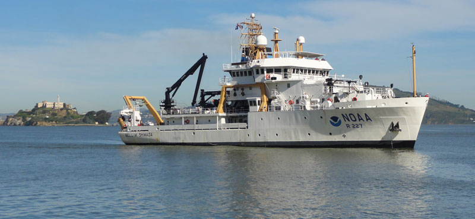

### Project Introduction

CalCOFI is an organization that focuses on studying the marine environment surrounding the California coast in order to investigate the relationships between climate, fish population, and other human activities.

Our project focuses on two separate datasets: 

1. Fish larvae catch data from CalCOFI cruises. This data is used to measure populations of various fish species.
2. Commercial fish data from multiple California fisheries. This data is used to supplement the fish larvae catch data.

This project seeks to establish whether any correlations can be drawn from the two datasets, as well as investigate any environmental factors that may add variance to the relationship.

While the dataset contains information of six different fish species, this project primarily focuses on _Sardinops sagax_, or more commonly known as Pacific Sardine.

_Source: CalCOFI_

